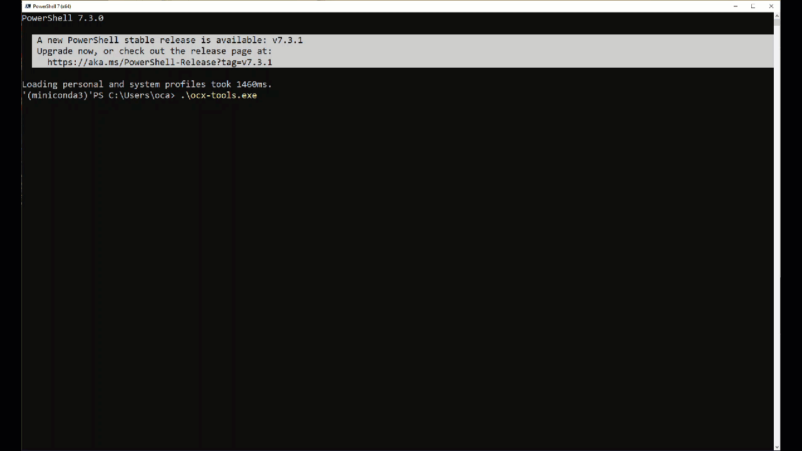

# OCX-tools

**OCX-tools** is an interactive command line interface (CLI) providing a set of utility tools to work with the [Open Class 3D Exchange (OCX)](https://github.com/OCXStandard/OCX_Schema) XSD schema.


## Motivation

The main motivation is to provide a set of tools to help the OCX standards community in maintaining and developing the OCX shchema. The toolset is a complement to the commercially available tools like XML tool as XMLSpy or Oxygen XML.
## Installation

We use the [Conda](https://conda.io/projects/conda/en/latest/index.html) package manager for building the python
packages and distributing it. The motivation for this is to
ensure cross-platform portability and benefit
from [improved vulnerability scanning in Conda](https://pythonspeed.com/articles/conda-security-scans/).

Install the package using Conda (a prerequisite is
an [Anaconda or miniconda installation](https://conda.io/projects/conda/en/latest/user-guide/install/index.html) on your
system):

```
conda install -c conda-forge ocx_schema_reader
```

## The tools

### OCX

The ``OCX`` interactive shell implements the top level interactive command line interface (CLI)
using [click-shell](https://pypi.org/project/click-shell/)
and [Click](https://click.palletsprojects.com/en/8.1.x/).

This shell utility is an interactive CLI with sub-commands. The main CLI implements generic functionalities such as
output formatting and setting the logging level while the sub-commands implements domain specific commands.

#### Usage
```commandline

             ,----..
            /   /   \    ,----..   ,--,     ,--,
           /   .     :  /   /   \  |'. \   / .`|
          .   /   ;.  \|   :     : ; \ `\ /' / ;
         .   ;   /  ` ;.   |  ;. / `. \  /  / .'          ______   ___    ___   _     _____
         ;   |  ; \ ; |.   ; /--`   \  \/  / ./          |      | /   \  /   \ | |   / ___/
         |   :  | ; | ';   | ;       \  \.'  /     _____ |      ||     ||     || |  (   \_
         .   |  ' ' ' :|   : |        \  ;  ;     |     ||_|  |_||  O  ||  O  || |___\__  |
         '   ;  \; /  |.   | '___    / \  \  \    |_____|  |  |  |     ||     ||     /  \ |
          \   \  ',  / '   ; : .'|  ;  /\  \  \            |  |  |     ||     ||     \    |
           ;   :    /  '   | '/  :./__;  \  ;  \           |__|   \___/  \___/ |_____|\___|
            \   \ .'   |   :    / |   : / \  \  ;
             `---`      \   \ .'  ;   |/   \  ' |
                         `---`    `---'     `--`

Version: 0.1.0.dev1
Copyright (c) 2023. OCX Consortium https://3docx.org

Effective log level is: INFO
Starting OCX...
OCX > help

Documented commands (type help <topic>):
========================================
clear  log-level  schema  set-level  table-defaults  table-options

Undocumented commands:
======================
exit  help  quit
```

### schema
The ```schema``` shell utility implements the parsing of the schema. An OCX schema can be parsed from a local XSD file or from a valid URL.  The 

#### Usage
````commandline
OCX > schema
Default schema: https://raw.githubusercontent.com/OCXStandard/OCX_Schema/working_draft/OCX_Schema.xsd
Parse it using the 'parse' command
Starting schema..
schema > help

Documented commands (type help <topic>):
========================================
assign-folder     attributes  element-types  namespace     summary
assign-schema     changes     elements       parse
attribute-groups  complex     inspect        simple-types

Undocumented commands:
======================
exit  help  quit
````



## Development Environment

### Project structure

The project structure consists of the build folder `dist`, the Sphinx documentation folder `docs`, the python module
folders `ocx_tools`, `ocx_xml` and the `tests` folder:

```
ocx-tools
├───dist
├───docs
│   └───source
├───htmlcov
├───ocx_tools
│   ├───cli
│   ├───configs
│   ├───schema
│   ├───schema_xml
│   ├───utils
└───tests

```
### Makefile
A tailor-made Makefile can be used to simplify the main development tasks
Rune ```make``` in the shell from the project root folder to print the **Makefile** help:
```
$ make
    build-exe                      Build a bundled package (on windows: an exe file) executable using pyinstaller
    bump-dev                       Bump the version the next version. All version strings will be updated
    check-jake                     Detailed report from jake security scanner on all modules installed in the conda environment
    check-lint                     Run formatters, linters, and static code security scanners bandit and jake
    conda-activate                 Activate the conda environment for the project
    conda-dev                      Create a conda development environment from environment.yaml and install all packages
    conda-lock                     Update the conda development environment when environment.yaml has changed
    conda-upd                      Update the conda development environment when environment.yaml has changed
    doc-help                       Sphinx options when running make from the docs folder
    doc-serve                      Open the the html docs built by Sphinx
    doc                            Build the html docs using Sphinx. For other Sphinx build options, run make in the docs folder
    help                           Show this help
    run                            Start ocx-tools CLI
    test-cov                       Show the test coverage report
    test-upd                       Update the regression tests baseline
    test                           Run unit and integration tests
```
## Testing
All the tests can be executed using the Makefile command ```make test```:
````commandline
make test
========================================================================================================== test session starts ==========================================================================================================
platform win32 -- Python 3.10.8, pytest-7.2.1, pluggy-1.0.0
rootdir: C:\PythonDev\ocx-tools
plugins: cov-4.0.0, datadir-1.4.1, regressions-2.4.2
collected 51 items

tests\test_main_cli.py ..                                                                                                                                                                                                          [  3%] 
tests\test_schema_helpers.py ..                                                                                                                                                                                                    [  7%]
tests\test_schema_reader.py .......                                                                                                                                                                                                [ 21%]
tests\test_xml_element.py .................................                                                                                                                                                                        [ 86%]
tests\test_xml_parser.py .......                                                                                                                                                                                                   [100%]

Version: 0.1.0.dev1
Copyright (c) 2023. OCX Consortium https://3docx.org


========================================================================================================== slowest 5 durations ========================================================================================================== 
0.75s setup    tests/test_schema_reader.py::TestOcxSchema::test_summary_table
0.73s setup    tests/test_schema_reader.py::TestOcxSchema::test_tbl_attribute_groups
0.72s setup    tests/test_schema_reader.py::TestOcxSchema::test_get_ocx_element_from_type
0.72s setup    tests/test_schema_reader.py::TestOcxSchema::test_attribute_types
0.72s setup    tests/test_schema_reader.py::TestOcxSchema::test_element_types
========================================================================================================== 51 passed in 6.71s =========================================================================================================== 

````
## Test coverage
A test coverage report is produced during the execution of the tests. Inspect it with the ```make test-cov``` command (example only):
```commandline
$make test-cov
Coverage report: 69%
coverage.py v7.0.5, created at 2023-01-16 14:43 +0100
```

| Module  | statements  | missing  |  excluded | coverage  |
|---|---|---|---|---|	 	 	 	
ocx_tools\__init__.py            |    3|  0| 	0| 	100%|
ocx_tools\cli\__init__.py        |   13|  0| 	0| 	100%|
ocx_tools\cli\cli_context.py 	 |   47|  6|	0|	87% |
ocx_tools\cli\cli_main.py 	     |   76| 13|	0|	83% |
ocx_tools\cli\schema.py 	     |  204|142|   0 |	30% |
ocx_tools\schema\__init__.py 	 |   9 |  0|	0|	100%|
ocx_tools\schema\data_classes.py |   29|  0|	0|	100%|
ocx_tools\schema\elements.py 	 |  190| 81|	0|	57% |
ocx_tools\schema\helpers.py 	 |   80|  9|	0|	89% |
ocx_tools\schema\parser.py 	     |  323| 63|	0|	80% |
ocx_tools\schema_xml\__init__.py | 	0  |  0|	0|	100%|
ocx_tools\schema_xml\element.py  |	186| 21|	0|	89% |
ocx_tools\schema_xml\parse.py 	 | 60  | 10|	0|	83% |
ocx_tools\utils\__init__.py 	 | 92  | 62|	0|	33% |
```
coverage.py v7.0.5, created at 2023-01-16 16:47 +0100
```

## Code style

If you're using any code style like xo, standard etc. That will help others while contributing to your project. Ex. -

[](https://github.com/feross/standard)

## Screenshots

Include logo/demo screenshot etc.

## Tech/framework used

[Click](https://click.palletsprojects.com/en/8.1.x/)

<b>Built with</b>
[Poetry](https://python-poetry.org/)

## Features

What makes your project stand out?

## Code Example

Show what the library does as concisely as possible, developers should be able to figure out **how** your project solves
their problem by looking at the code example. Make sure the API you are showing off is obvious, and that your code is
short and concise.


## API Reference

[](https://ocx-tools.readthedocs.io/en/latest/?badge=latest)


The API documentation is built using Sphinx. The documentation is published to Read The Docs for the latest version:
[API documentation](https://ocx-tools.readthedocs.io/en/latest/index.html)


### CDI


see (http://www.sefidian.com/2021/08/03/how-to-use-black-flake8-and-isort-to-format-python-codes/)

### Build status of continuous integration

[](https://github.com/pre-commit/pre-commit)
[](https://travis-ci.org/akashnimare/foco)
[](https://ci.appveyor.com/project/akashnimare/foco/branch/master)


## License

MIT © [3Docx.org](https://3docx.org)