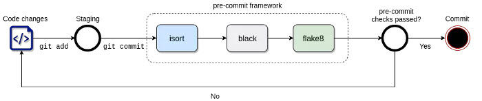

# ocx-schema-reader

The project implements a command line interface for parsing
the [Open Class 3D Exchange (OCX)](https://github.com/OCXStandard/OCX_Schema) schema including command line
functionality to output schema change history and inspect schema element data.

## Motivation

The package will make the schema content more accessible and is a building block for providing other OCX schema tools
like a schema validator and automated schema documentation.

## Installation

We use the [Conda](https://conda.io/projects/conda/en/latest/index.html) package manager for building the python
packages and distributing it. The motivation for this is to
ensure cross-platform portability and benefit
from [improved vulnerability scanning in Conda](https://pythonspeed.com/articles/conda-security-scans/).

Install the package using Conda (a prerequisite is
an [Anaconda or miniconda installation](https://conda.io/projects/conda/en/latest/user-guide/install/index.html) on your
system):

```
conda install -c conda-forge ocx_schema_reader
```

## Usage

## Build status

Build status of continuous integration

[](https://github.com/pre-commit/pre-commit)
[](https://travis-ci.org/akashnimare/foco)
[](https://ci.appveyor.com/project/akashnimare/foco/branch/master)

## Code style

If you're using any code style like xo, standard etc. That will help others while contributing to your project. Ex. -

[](https://github.com/feross/standard)

## Screenshots

Include logo/demo screenshot etc.

## Tech/framework used

[Click](https://click.palletsprojects.com/en/8.1.x/)

<b>Built with</b>
[Poetry](https://python-poetry.org/)

## Features

What makes your project stand out?

## Code Example

Show what the library does as concisely as possible, developers should be able to figure out **how** your project solves
their problem by looking at the code example. Make sure the API you are showing off is obvious, and that your code is
short and concise.

## Project structure

The project structure consists of the build folder `dist`, the Sphinx documentation folder `docs`, the python module
folders `ocx_schema_reader`, `ocx_xml` and the `tests` folder:

```
ocx-schema-reader
├───dist
├───docs
├───ocx_schema_reader
├───tests
```

## Installation

*Prerequisite*: poetry must be installed in your python environment.
Run the following commands in a terminal to install and launch the ocx-schema-reader.

```
$ git clone git@github.com:OCXStandard/ocx-schema-reader.git
$ cd ocx-schema-reader
$ poetry shell
$ poetry install
$ poetry run
```

## Dependency management

This project uses [pip-compile-multi](https://pypi.org/project/pip-compile-multi/) for hard-pinning dependencies
versions.
Please see its documentation for usage instructions.
In short, `requirements/base.in` contains the list of direct requirements with occasional version constraints (
like `Django<2`)
and `requirements/base.txt` is automatically generated from it by adding recursive tree of dependencies with fixed
versions.
The same goes for `test` and `dev`.

To upgrade dependency versions, run `pip-compile-multi`.

To add a new dependency without upgrade, add it to `requirements/base.in` and run `pip-compile-multi --no-upgrade`.

For installation always use `.txt` files. For example, command `pip install -Ue . -r requirements/dev.txt` will install
this project in development mode, testing requirements and development tools.
Another useful command is `pip-sync requirements/dev.txt`, it uninstalls packages from your virtualenv that aren't
listed in the file.

## API Reference

The API documentation is built using Sphinx. The documentation is published to Read The Docs for the latest version:
[Read the Docs API documentation](https://ocx-schema-reader.readthedocs.io/en/latest/index.html)

## Tests

Describe and show how to run the tests with code examples.

## How to use?

If people like your project they’ll want to learn how they can use it. To do so include step by step guide to use your
project.

## Contribute

Let people know how they can contribute into your project.
A [contributing guideline](https://github.com/zulip/zulip-electron/blob/master/CONTRIBUTING.md) will be a big plus.

### CDI


see (http://www.sefidian.com/2021/08/03/how-to-use-black-flake8-and-isort-to-format-python-codes/)

## Credits

Give proper credits. This could be a link to any repo which inspired you to build this project, any blogposts or links
to people who contrbuted in this project.

#### Anything else that seems useful

## License

MIT © [3Docx.org](https://3docx.org)