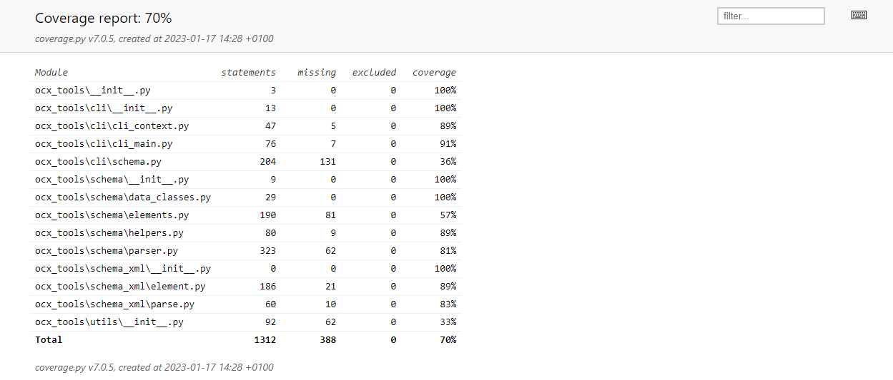

# OCX-tools

**OCX-tools** is an interactive command line interface (CLI) providing a set of utility tools to work with the [Open Class 3D Exchange (OCX)](https://github.com/OCXStandard/OCX_Schema) XSD schema.


## Motivation

The main motivation is to provide a set of tools to help the OCX standards community in maintaining and developing the OCX shchema. The toolset is a complement to the commercially available tools like XML tool as XMLSpy or Oxygen XML.

## The OCX-tools
The OCX-tools is a set of interactive command line (CLI) shell utilities. The different CLIs are described in the subsequent sections.

### OCX

The ``OCX`` interactive shell implements the top level interactive command line interface (CLI)
using [click-shell](https://pypi.org/project/click-shell/)
and [Click](https://click.palletsprojects.com/en/8.1.x/).

This shell utility is an interactive CLI with sub-commands. The main CLI implements generic functionalities such as
output formatting and setting the logging level while the sub-commands implements domain specific commands.

#### Usage
```commandline

             ,----..
            /   /   \    ,----..   ,--,     ,--,
           /   .     :  /   /   \  |'. \   / .`|
          .   /   ;.  \|   :     : ; \ `\ /' / ;
         .   ;   /  ` ;.   |  ;. / `. \  /  / .'          ______   ___    ___   _     _____
         ;   |  ; \ ; |.   ; /--`   \  \/  / ./          |      | /   \  /   \ | |   / ___/
         |   :  | ; | ';   | ;       \  \.'  /     _____ |      ||     ||     || |  (   \_
         .   |  ' ' ' :|   : |        \  ;  ;     |     ||_|  |_||  O  ||  O  || |___\__  |
         '   ;  \; /  |.   | '___    / \  \  \    |_____|  |  |  |     ||     ||     /  \ |
          \   \  ',  / '   ; : .'|  ;  /\  \  \            |  |  |     ||     ||     \    |
           ;   :    /  '   | '/  :./__;  \  ;  \           |__|   \___/  \___/ |_____|\___|
            \   \ .'   |   :    / |   : / \  \  ;
             `---`      \   \ .'  ;   |/   \  ' |
                         `---`    `---'     `--`

Version: 0.1.0.dev1
Copyright (c) 2023. OCX Consortium https://3docx.org

Effective log level is: INFO
Starting OCX...
OCX > help

Documented commands (type help <topic>):
========================================
clear  log-level  schema  set-level  table-defaults  table-options

Undocumented commands:
======================
exit  help  quit
```

### schema
The ```schema``` shell utility implements the parsing of the schema. An OCX schema can be parsed from a local XSD file or from a valid URL.  The 

#### Usage
````commandline
OCX > schema
Default schema: https://raw.githubusercontent.com/OCXStandard/OCX_Schema/working_draft/OCX_Schema.xsd
Parse it using the 'parse' command
Starting schema..
schema > help

Documented commands (type help <topic>):
========================================
assign-folder     attributes  element-types  namespace     summary
assign-schema     changes     elements       parse
attribute-groups  complex     inspect        simple-types

Undocumented commands:
======================
exit  help  quit
````


## The development environment

### Project structure

The project structure consists of the build folder `dist`, the Sphinx documentation folder `docs`, the python module
folders `ocx_tools`, `ocx_xml` and the `tests` folder:

```
ocx-tools
├───dist
├───docs
│   └───source
├───htmlcov
├───ocx_tools
│   ├───cli
│   ├───configs
│   ├───schema
│   ├───schema_xml
│   ├───utils
└───tests

```
### Makefile
A tailor-made Makefile in the root folder can be used to simplify the main development tasks
Rune ```make``` in the shell from the project root folder to print the **Makefile** help:
```
$ make
    build-exe                      Build a bundled package (on windows: an exe file) executable using pyinstaller
    bump-dev                       Bump the version the next version. All version strings will be updated
    check-jake                     Detailed report from jake security scanner on all modules installed in the conda environment
    check-lint                     Run formatters, linters, and static code security scanners bandit and jake
    conda-activate                 Activate the conda environment for the project
    conda-dev                      Create a conda development environment from environment.yaml and install all packages
    conda-lock                     Update the conda development environment when environment.yaml has changed
    conda-upd                      Update the conda development environment when environment.yaml has changed
    doc-help                       Sphinx options when running make from the docs folder
    doc-serve                      Open the the html docs built by Sphinx
    doc                            Build the html docs using Sphinx. For other Sphinx build options, run make in the docs folder
    help                           Show this help
    run                            Start ocx-tools CLI
    test-cov                       Show the test coverage report
    test-upd                       Update the regression tests baseline
    test                           Run unit and integration tests
```
### Conda

We use the [Conda](https://conda.io/projects/conda/en/latest/index.html) package manager for providing the required python
packages. The motivation for this is to ensure cross-platform portability and benefit
from [improved vulnerability scanning in Conda](https://pythonspeed.com/articles/conda-security-scans/).

Conda can be installed from an [Anaconda or miniconda installation](https://conda.io/projects/conda/en/latest/user-guide/install/index.html). 

### Maintaining package dependencies
The package dependencies are maintained in the yaml file ``environment.yaml`` located in the root folder. Conda will use this file to install the package dependencies.
To update the environment, run the Makefile command ``make conda-upd``.

### Locking the dependencies
When a new release is ready the package dependencies shall be locked. This can be done with the Makefile command ``make conda-lock``. Conda will create a lock file ``environment.lock.yaml``. 
This file is commited committed to source control with a release tag. 

### Angular style git commit messages 
``<type>`` refers to the kind of change made and is usually one of:

- ``feat``: A new feature.
- ``fix``: A bug fix.
- ``docs``: Documentation changes.
- ``style``: Changes that do not affect the meaning of the code (white-space, formatting, missing semi-colons, etc).
- ``refactor``: A code change that neither fixes a bug nor adds a feature.
- ``perf``: A code change that improves performance.
- ``test``: Changes to the test framework.
- ``build``: Changes to the build process or tools.

``scope`` is an optional keyword that provides context for where the change was made. It can be anything relevant to your package or development workflow (e.g., it could be the module or function name affected by the change).

### OCX-tools versioning
The OCX-tools versions is following the semantic versioning scheme from [semver.org](https://semver.org/). We use the python package [python-semantic-relaese](https://python-semantic-release.readthedocs.io/en/latest/) to automate the process of maintaining consistent version strings.

Python Semantic Release (PSR) is a tool that can automatically bump version numbers based on keywords it finds in commit messages. The idea is to use a standardized commit message format and syntax, which PSR can parse to determine how to increment the version number. The default commit message format used by PSR is the Angular commit style, which looks like this:
````commandline
<type>(optional scope): short summary in present tense

(optional body: explains motivation for the change)

(optional footer: note BREAKING CHANGES here, and issues to be closed)
````

### Automatic version bumping

## Testing
All the tests can be executed using the Makefile command ```make test```:
````commandline
make test
========================================================================================================== test session starts ==========================================================================================================
platform win32 -- Python 3.10.8, pytest-7.2.1, pluggy-1.0.0
rootdir: C:\PythonDev\ocx-tools
plugins: cov-4.0.0, datadir-1.4.1, regressions-2.4.2
collected 51 items

tests\test_main_cli.py ..                                                                                                                                                                                                          [  3%] 
tests\test_schema_helpers.py ..                                                                                                                                                                                                    [  7%]
tests\test_schema_reader.py .......                                                                                                                                                                                                [ 21%]
tests\test_xml_element.py .................................                                                                                                                                                                        [ 86%]
tests\test_xml_parser.py .......                                                                                                                                                                                                   [100%]

Version: 0.1.0.dev1
Copyright (c) 2023. OCX Consortium https://3docx.org


========================================================================================================== slowest 5 durations ========================================================================================================== 
0.75s setup    tests/test_schema_reader.py::TestOcxSchema::test_summary_table
0.73s setup    tests/test_schema_reader.py::TestOcxSchema::test_tbl_attribute_groups
0.72s setup    tests/test_schema_reader.py::TestOcxSchema::test_get_ocx_element_from_type
0.72s setup    tests/test_schema_reader.py::TestOcxSchema::test_attribute_types
0.72s setup    tests/test_schema_reader.py::TestOcxSchema::test_element_types
========================================================================================================== 51 passed in 6.71s =========================================================================================================== 

````
## Test coverage
A test coverage report is produced during the execution of the tests. Inspect it with the ```make test-cov``` command (example only):
```commandline
$make test-cov
```


## Code style

If you're using any code style like xo, standard etc. That will help others while contributing to your project. Ex. -

[](https://github.com/feross/standard)


## API Documentation

[](https://ocx-tools.readthedocs.io/en/latest/?badge=latest)


The API reference documentation is built using Sphinx. The documentation is published to Read The Docs for the latest version:
[API documentation](https://ocx-tools.readthedocs.io/en/latest/index.html)


### CDI


see (http://www.sefidian.com/2021/08/03/how-to-use-black-flake8-and-isort-to-format-python-codes/)

### Build status of continuous integration

[](https://github.com/pre-commit/pre-commit)
[](https://travis-ci.org/akashnimare/foco)
[](https://ci.appveyor.com/project/akashnimare/foco/branch/master)


## License

MIT © [3Docx.org](https://3docx.org)